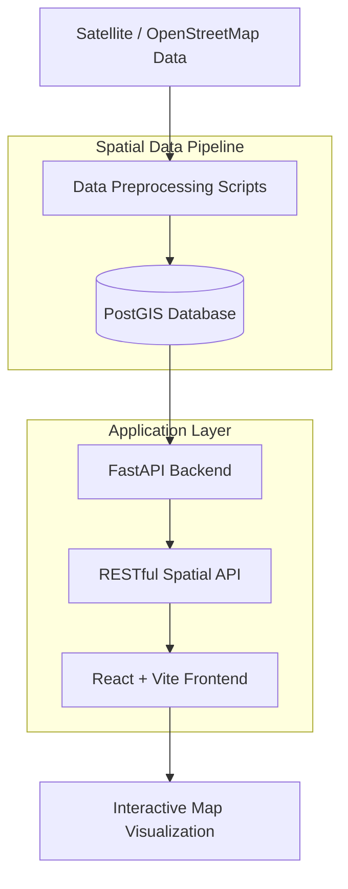

# Geo-AI: Flood Risk Analysis & Infrastructure Management

[](https://www.python.org/downloads/)
[](https://reactjs.org/)
[](https://fastapi.tiangolo.com/)

An advanced spatial analytics platform leveraging Artificial Intelligence and Geographic Information Systems (GIS) to assess flood risks and manage urban infrastructure in the Colombo North region.

---

## 🌟 Project Overview

GeoAI is a capstone project designed to bridge the gap between satellite imagery and actionable urban planning. By integrating PostGIS-driven spatial data with modern deep learning predictions, the platform provides high-fidelity visualizations and risk metrics for critical infrastructure.

### Key Features:
- **Interactive Spatial Visualization**: High-performance map rendering using MapLibre GL JS.
- **Flood Risk Assessment**: Real-time intersection analysis between infrastructure footprints and flood zones.
- **Deep Learning Ingestion**: Pipeline for processing satellite-derived predictions (e.g., building footprints).
- **Glassmorphic UI**: Premium, modern interface designed for intuitive data exploration.

---

## 📊 Technical Architecture



---

## 💾 Data Access

> [!IMPORTANT]
> **Large Data Notice**: To keep the repository lightweight, raw geospatial datasets (GeoTIFF, Shapefiles, GeoJSON) are NOT tracked by Git. 

You can download the full study area datasets from the official Google Drive link below:

🔗 **[Download GeoAI Datasets (Google Drive Placeholder)](https://drive.google.com/drive/folders/YOUR_LINK_HERE)**

After downloading, please extract the contents into the `data/raw/` and `data/processed/` directories.

---

## 🛠️ Development Setup

### Prerequisites
- **Python**: 3.9+ 
- **Node.js**: 16+ (npm or yarn)
- **Docker**: For running the PostGIS spatial database

### Setup Instructions

1. **Clone the Repository**
   ```bash
   git clone https://github.com/YOUR_USERNAME/GeoAI.git
   cd GeoAI
   ```

2. **Database Initialization**
   Start the spatial database using Docker Compose:
   ```bash
   docker-compose up -d db
   ```

3. **Backend Configuration**
   ```bash
   cd backend
   pip install -r requirements.txt
   # (Optional) Create .env file for database credentials
   ```

4. **Frontend Configuration**
   ```bash
   cd ../frontend
   npm install
   ```

5. **Launch Application**
   Run the unified startup script from the root directory:
   ```bash
   ./dev.sh
   ```
   - **Backend**: [http://localhost:8000](http://localhost:8000)
   - **Frontend**: [http://localhost:5173](http://localhost:5173)

---

## 📁 Project Structure

| Directory | Description |
| :--- | :--- |
| `backend/` | FastAPI spatial API and data analysis logic |
| `frontend/` | React + Vite dashboard and MapLibre viz |
| `notebooks/` | EDA, model training, and research reports |
| `data/` | Data storage (Raw & Processed) - *Ignored in Git* |
| `scripts/` | Utility scripts for data seeding and processing |
| `docs/` | Project reports and university documentation |

---

*Developed as part of the MDSAI Capstone Project - 2026*
